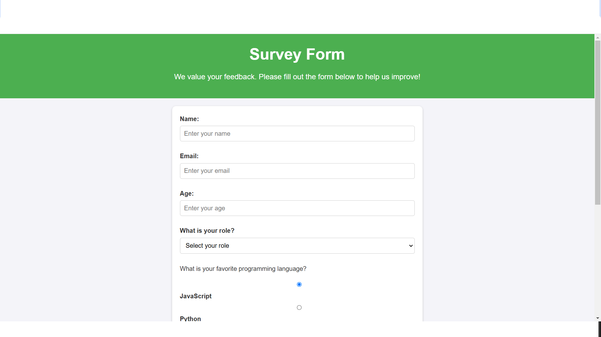

# Survey-Form

This is a simple survey form web application. The form collects user information such as name, email, age, role, favorite programming language, hobbies, and additional comments.

## Screenshot



## Features

- Responsive design
- User-friendly form inputs
- Collects user feedback

## Technologies Used

- HTML
- CSS

## How to Use

1. Clone the repository:
    ```sh
    git clone https://github.com/AlyAtalla/Survey-Form.git
    ```
2. Open `index.html` in your web browser.

## License

This project is licensed under the MIT License - see the [LICENSE](LICENSE) file for details.